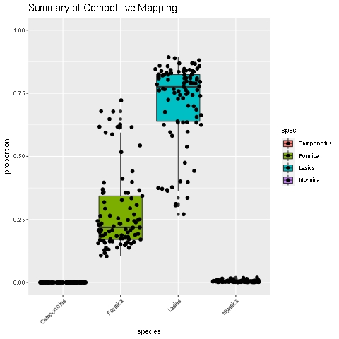

# Competitive-Mapping :dna::ant:
Used to map potentially contaminated reads against potential contaminant genomes. For use on HPC cluster with bash scripts
---
## Inputs needed:
- List of contaminated read IDs
- Directory of reads in .fq format
- Genomes of target and contaminate species in .fasta format  
  
BE SURE TO CHANGE `YOURDIR` VARIABLE IN ALL `.sh` AND `.r` FILES TO YOUR WORKING DIRECTORY!   
As well as read(`supermap.sh`) and contaminated genome diretory path(`scafname.sh`). (Paths to be changed noted in script file)
  
---
### Step 1: Add species name to their scaffold/chromosome names to distinguish and concatenate target+contaminant genomes  
- Input: target and contaminant genomes `GENOME.fasta`
- Script: `scafname.sh`  (replace GENDIR to genome directory path)
- Output: `scafs.txt` (to verify scaffold names have been changed)    
          `GENOME_name.fasta` (genome with new scaffold names)  
          `catgen.fasta` (fasta file of all genomes combined)  

### Step 2: Loop through contaminated reads to map against catgen.fasta with BWA mem   
- Input: `catgen.fasta`, list of contaminated read IDs(replace `samps`)
- Script: `supermap.sh`
- Output: `catgen_$READ.bam` (.bam file made for each contaminated read, labelled with ID name)  
         `catgen_flagstat.txt` (flagstat summary of all read mapping to verify it worked correctly)  
           
### Step 3: Convert .bam to .sam file and run R script to create plots of read mapping   
- Input:`catgen_$READ.bam`
- Script:`catgen.sh`, `catgen.r`  
- Output:`/sam/catgen_$READ.sam` (readable .sam output)  
        `/sam/cut/catgen_$READ.sam` (removed headers of file, leaving only data table)  
        `/mapplots/mapplot_$READ.jpeg` (.jpeg image of plot, showing the proportion of reads that mapped to each species' genome)  
        `mapplot_summary.jpeg` (.jpeg image of summary of all sample mapping)

 Exampe of mapplot_$READ.jpeg output looking for contamination in Lasius species  
  

Exampe of mapplot_summary.jpeg output looking for contamination in Lasius species of 3 ant species     
 (possible contamination by Formica)  
 
  

