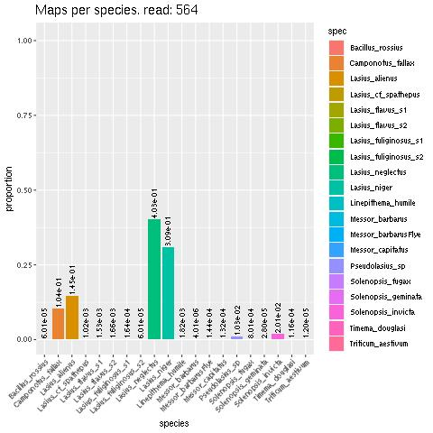

# Competitive-Mapping
Used to map potentially contaminated reads against potential contaminant genomes. For use on HPC cluster with bash scripts
---
## Inputs needed:
- List of contaminated read IDs
- Directory of reads in .fq format
- Genomes of target and contaminate species in .fasta format  
  
BE SURE TO CHANGE `YOURDIR=path/to/your/dir` IN ALL `.sh` AND `.r` FILES! As well as read(`supermap.sh`) and contaminated genome diretory path(`scafname.sh`)
  
---
### Step 1: Add species name to their scaffold/chromosome names to distinguish and concatenate target+contaminant genomes  
- Input: target and contaminant genomes (.fasta)
- Script: `scafname.sh`  
- Output: `scafs.txt` (to verify scaffold names have been changed)    
          `GENOME_name.fasta` (genome with new scaffold names)  
          `catgen.fasta` (fasta file of all genomes combined)  

### Step 2: Loop htrough contaminated reads to map against catgen.fasta with BWA mem   
- Input: `catgen.fasta`, list of contaminated read IDs(replace $samps)
- Script: `supermap.sh`
- Output: `catgen_$READ.bam` (.bam file made for each contaminated read, labelled with ID name)  
         `catgen_flagstat.txt` (flagstat summary of all read mapping to verify it worked correctly)  
           
### Step 3: Convert .bam to .sam file and run R script to create plots of read mapping   
- Input:`catgen_$READ.bam`
- Script:`catgen.sh`, `catgen.r`  
- Output:`/sam/catgen_$READ.sam` (readable .sam output)  
        `/sam/cut/catgen_$READ.sam` (removed headers of file, leaving only data table)  
        `mapplot_$READ.jpeg` (.jpeg image of plot, showing the proportion of reads that mapped to each species' genome)

** Exampe of mapplot output **

